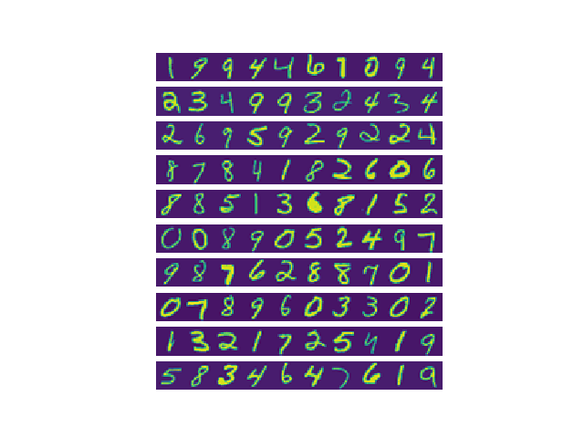

# Back Propagation

In this exercise, you will implement the backpropagation algorithm
to learn the parameters for the neural network.

## Visualizing the data

This is the same dataset that you used in the previous exercise. There are
5000 training examples in ex3data1.mat, where each training example is a
20 pixel by 20 pixel grayscale image of the digit. Each pixel is represented by
a floating point number indicating the grayscale intensity at that location.
The 20 by 20 grid of pixels is \unrolled" into a 400-dimensional vector. Each
of these training examples becomes a single row in our data matrix X. This
gives us a 5000 by 400 matrix X where every row is a training example for a
handwritten digit image

The second part of the training set is a 5000-dimensional vector y that
contains labels for the training set. Therefore, a \0" digit is labeled as \10", while
the digits \1" to \9" are labeled as \1" to \9" in their natural order

## Model representation

Our neural network is shown in Figure 2. It has 3 layers { an input layer,
a hidden layer and an output layer. Recall that our inputs are pixel values
of digit images. Since the images are of size 20 × 20, this gives us 400 input
layer units (not counting the extra bias unit which always outputs +1). The
training data will be loaded into the variables X and y by the ex4.m script.
You have been provided with a set of network parameters (Θ(1); Θ(2))
already trained by us. These are stored in ex4weights.mat and will be
loaded by ex4.m into Theta1 and Theta2. The parameters have dimensions
that are sized for a neural network with 25 units in the second layer and 10
output units (corresponding to the 10 digit classes).

## Feedforward and cost function

Implementation Note: The matrix X contains the examples in rows
(i.e., X(i,:)’ is the i-th training example x(i), expressed as a n × 1
vector.) When you complete the code in nnCostFunction.m, you will
need to add the column of 1’s to the X matrix. The parameters for each
unit in the neural network is represented in Theta1 and Theta2 as one
row. Specifically, the first row of Theta1 corresponds to the first hidden
unit in the second layer. You can use a for-loop over the examples to
compute the cost.
Once you are done, call your nnCostFunction() using the loaded
set of parameters for Theta1 and Theta2. You should see that the cost is
about 0.287629.

## Regularized cost function

## Backpropagation

In this part of the exercise, you will implement the backpropagation algorithm to compute the gradient for the neural network cost function. You
will need to complete the nnCostFunction.m so that it returns an appropriate value for grad. Once you have computed the gradient, you will be able
to train the neural network by minimizing the cost function J(Θ) using an
advanced optimizer such as **minimize**.
You will first implement the backpropagation algorithm to compute the
gradients for the parameters for the (unregularized) neural network.

## Sigmoid gradient

## Random initialization
When training neural networks, it is important to randomly initialize the parameters for symmetry breaking. One effective strategy for random initialization is to randomly select values for Θ(l) uniformly in the range [−EPS_init; EPS_init].
You should use Eps_init = 0:12.2 This range of values ensures that the parameters
are kept small and makes the learning more efficient. RandInitializeWeights() is initialize the weights
for Θ;

## Regularized Neural Networks

## Learning parametrs using minimize

After the training completes, script will proceed to report the
training accuracy of your classifier by computing the percentage of examples
it got correct. If your implementation is correct, you should see a reported
training accuracy of about 95.3% (this may vary by about 1% due to the
random initialization). It is possible to get higher training accuracies by
training the neural network for more iterations. We encourage you to try
training the neural network for more iterations (e.g., set MaxIter to 400) and
also vary the regularization parameter λ. With the right learning settings, it
is possible to get the neural network to perfectly fit the training set.
